# Fine-Grained Authorization POC

## 🎯 Goal
This project demonstrates a modern **Externalized Authorization** architecture. The goal is to decouple authentication and authorization logic from the application code, moving it into a dedicated infrastructure layer. This approach enables:
*   **Centralized Policy Management**: Security rules are defined in one place, not scattered across codebases.
*   **Polyglot Support**: Works with any backend language (Go, Node, Python, etc.).
*   **Flexibility**: Combines Attribute-Based Access Control (ABAC) and Relationship-Based Access Control (ReBAC).
*   **AI-Driven Management**: Simplifies policy creation using Generative AI.

## 🏗 Concept & Architecture

The system uses a **Sidecar / Gateway pattern**:

1.  **Intercept**: **Envoy Proxy** acts as the API Gateway. All traffic goes through it.
2.  **Authenticate**: Envoy handles OIDC flows with **Keycloak**, ensuring users are logged in before they reach the app.
3.  **Authorize**: Envoy delegates the "Allow/Deny" decision to **OPA** (Open Policy Agent) via gRPC.
4.  **Enforce**: 
    *   If allowed, the request is forwarded to the application.
    *   If denied, Envoy returns a custom 403 HTML page (generated by OPA).

### Authorization Flow
`User` -> `Envoy` -> `Keycloak (Login)` -> `Envoy` -> `OPA (Policy Check)` -> [`OpenFGA (Relationship Check)`] -> `Backend App`

### Diagram

```mermaid
graph LR
    User[User] --> Envoy[Envoy Proxy :8000]
    Envoy -->|Ext Authz| OPA[OPA :8181]
    OPA -->|ReBAC Check| OpenFGA[OpenFGA :8081]
    Envoy -->|Allowed| App[Test App :3000]
    
    User -->|Manage Rules| AI[AI Manager :5001]
    AI -->|Gen Policy| Gemini[Google Gemini]
    AI -->|Update| OPA
    AI -->|Update| OpenFGA
```


## 🧩 Services

| Service | Role | Description |
| :--- | :--- | :--- |
| **Envoy Proxy** | **PEP** (Policy Enforcement Point) | The front door. Handles routing, logging, OIDC authentication, and calls OPA for authorization decisions. |
| **Keycloak** | **IdP** (Identity Provider) | Manages users (Alice, Bob) and issues JWT tokens via OpenID Connect. |
| **OPA** | **PDP** (Policy Decision Point) | The "Brain". Evaluates requests against `.rego` policies (ABAC). It decides *if* access is allowed. |
| **OpenFGA** | **ReBAC** Engine | Stores fine-grained relationships (e.g., "Alice *is viewer of* Document A"). OPA can query this for complex checks. |
| **AI Manager** | Management UI | A custom Node.js app powered by **Google Gemini**. It allows you to chat with your policies and generate rules using natural language. |
| **Test App** | Backend Service | A simple Go application with `/public` and `/api/protected` endpoints. It trusts Envoy to handle security. |
| **Postgres** | Database | Persists data for Keycloak and OpenFGA. |

## 🚀 Quick Start

### Prerequisites
*   Podman (or Docker)
*   Google Gemini API Key (for AI Manager)

### Setup
1.  **Configure Environment**:
    Open `.env` and paste your Gemini API Key:
    ```bash
    GEMINI_API_KEY=AIzaSy...
    ```

2.  **Run the Stack**:
    ```bash
    ./run_poc.sh
    ```

3.  **Setup Keycloak** (First run only):
    The `setup_keycloak.sh` script runs automatically, creating the `AuthorizationRealm`, client `envoy`, and users `alice` and `bob`.

### Usage
*   **Public Access**: [http://localhost:8000/public](http://localhost:8000/public)
*   **Protected Access**: [http://localhost:8000/api/protected](http://localhost:8000/api/protected)
    *   Redirects to Keycloak. Login with `alice` / `alice`.
*   **AI Manager**: [http://localhost:5001](http://localhost:5001)
    *   Chat with your policies or generate new ones.

## 🖥 Running on Synology NAS

This project can run on a Synology NAS using Docker (Container Manager). The project lives at `/volume1/docker/authz_poc/`.

### Prerequisites
*   Synology DSM with **Container Manager** (Docker) installed
*   SSH access enabled on the NAS
*   Google Gemini API Key (for AI Manager)

### Setup

1.  **Clone the repo** via SSH:
    ```bash
    ssh your-nas
    cd /volume1/docker
    git clone <repo-url> authz_poc
    cd authz_poc
    ```

2.  **Configure environment**:
    ```bash
    echo "GEMINI_API_KEY=AIzaSy..." > /volume1/docker/authz_poc/.env
    ```

3.  **Set the external URL** to your NAS IP or hostname. Edit the `docker-compose.yml` and update the `EXTERNAL_URL` environment variable for both the `envoy` and `test-app` services:
    ```yaml
    # In the envoy service:
    environment:
      EXTERNAL_URL: http://<NAS_IP>:8000

    # In the test-app service:
    environment:
      EXTERNAL_URL: http://<NAS_IP>:8000
    ```
    Replace `<NAS_IP>` with your Synology's local IP (e.g., `192.168.1.50`) or hostname.

4.  **Build and start** the stack:
    ```bash
    cd /volume1/docker/authz_poc
    docker compose build
    docker compose up -d
    ```

5.  **Update Keycloak redirect URIs** if using a custom hostname or IP. The realm config (`infra/keycloak/realm.json`) already includes `http://localhost:8000/*` in `redirectUris`. Add your NAS URL:
    ```json
    "redirectUris": ["http://localhost:8000/*", "http://<NAS_IP>:8000/*"],
    "webOrigins": ["http://localhost:8000", "http://<NAS_IP>:8000"],
    ```
    Then restart Keycloak: `docker compose restart keycloak`

### Synology-specific notes

*   **OPA platform**: The OPA image uses `platform: linux/amd64`. This works on x86 Synology models (DS920+, DS1621+, etc.). ARM-based models (DS220j, etc.) are not supported.
*   **Port conflicts**: If ports `8000`, `8081`, or `8181` conflict with other services on your NAS, remap them in `docker-compose.yml` under the relevant `ports:` sections.
*   **Persistence**: Postgres data, OpenFGA config, and app data use Docker named volumes. These survive container restarts and are stored in `/volume1/@docker/volumes/`.
*   **Firewall**: If the Synology firewall is enabled, allow inbound TCP on port `8000` (or your remapped port) for LAN access.
*   **Auto-start**: Container Manager automatically restarts containers after a NAS reboot if the restart policy is set. Add `restart: unless-stopped` to each service in `docker-compose.yml` for this behavior.
*   **Logs**: View logs via Container Manager UI or SSH:
    ```bash
    cd /volume1/docker/authz_poc
    docker compose logs -f envoy
    docker compose logs -f test-app
    ```

### Access

*   **Public page**: `http://<NAS_IP>:8000/public`
*   **Authenticated home**: `http://<NAS_IP>:8000/home` (redirects to Keycloak login)
*   **AI Manager**: `http://<NAS_IP>:8000/manager`

## 📂 Project Structure
*   `infra/envoy/`: Envoy proxy configuration.
*   `infra/opa/`: OPA configuration and `.rego` policies.
*   `infra/keycloak/`: Keycloak realm config and custom login theme.
*   `infra/postgres/`: Database initialization scripts.
*   `ai-manager/`: Source code for the AI management interface.
*   `test-app/`: Source code for the backend service.
